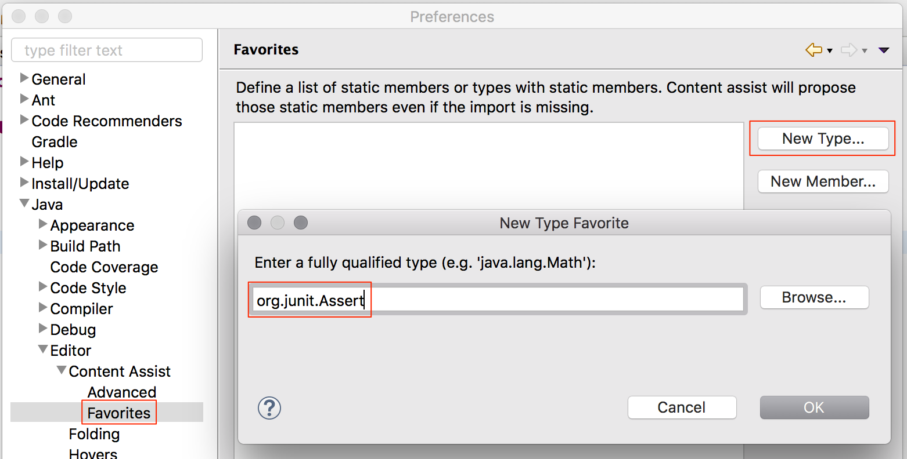
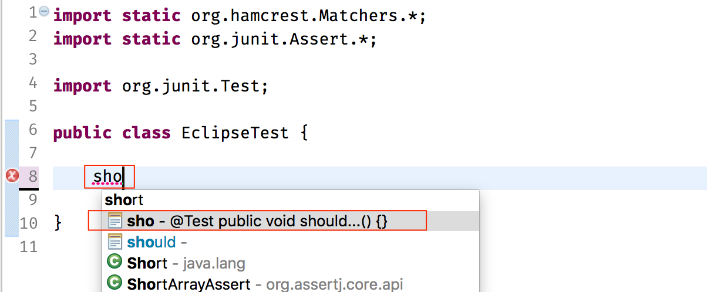

# Eclipse 技巧

## 静态导入设置

由于 Hamcrest、Mockito 以及其他一些工具都使用了静态方法作为语句的入口，使用`static import`省去方法所属的类名会让代码阅读起来更流畅，而 Eclipse 中默认在敲出静态方法名时代码辅助功能是无效的，需要进行设置，步骤如下。

1. 开启静态导入

进入`Preference -> Java -> Editor -> Content Assist`，勾选`Use static imports (only 1.5 or higher)`


2.  添加静态导入的类型

        进入`Preference -> Java -> Editor -> Content Assist -> Favorites`，点击`New Type...`分别加入如下类型：
        `org.junit`
        `org.junit.Assert`
        `org.hamcrest.CoreMatchers`
        `org.hamcrest.Matchers`
        `org.mockito.BDDMockito`或`org.mockito.Mockito`
        
        > 如果还有其它需要静态导入的成员，请自行添加

    进入`Preference -> Java -> Editor -> Content Assist`，勾选`Use static imports (only 1.5 or higher)`
    

3.  添加静态导入的类型

进入`Preference -> Java -> Editor -> Content Assist -> Favorites`，点击`New Type...`分别加入如下类型：
`org.junit`
`org.junit.Assert`
`org.hamcrest.CoreMatchers`
`org.hamcrest.Matchers`
`org.mockito.BDDMockito`或`org.mockito.Mockito`


> 如果还有其它需要静态导入的成员，请自行添加
>

这样修改之后，不需再敲击`Assert.`之后才能选择`assertThat`方法；直接敲击`at`之后代码补全就可以找到对应的方法，最终效果如下：


进入`Preference -> Java -> Editor -> Content Assist -> Favorites`，点击`New Type...`分别加入如下类型：
`org.junit`
`org.junit.Assert`
`org.hamcrest.CoreMatchers`
`org.hamcrest.Matchers`
`org.mockito.BDDMockito`或`org.mockito.Mockito`
 > 如果还有其它需要静态导入的成员，请自行添加

    这样修改之后，不需再敲击`Assert.`之后才能选择`assertThat`方法；直接敲击`at`之后代码补全就可以找到对应的方法，最终效果如下：
    

> > > > > > > Fix indents

## 测试代码模板

在编写单元测试的过程中，我们会经常要写一些重复的八股文代码，例如测试方法:

```java
@Test
public void should_...() {
}
```

这里的代码每个测试都需要写一遍，太繁琐，我们可以使用代码模板来自动生成它。当设置好代码模板之后，只需要敲几个字母就可以把代码补全出来，我们就可以专注于代码中真正有意义的那部分：这个测试的场景（方法名）

还有其他一些类似的情形，比如编写断言的时候，我们会写`assertThat(actual, is(matcher))`；也可以使用代码模板生产`assertThat(..., is(...))`之后在专注于填充实际值和期待值。

下面以添加缩写为`sho`的生成测试方法的模板为例介绍设置方法。

1. 进入`Preference -> Editor -> Code -> Templates`设置界面，点击`New...`开始新建模板

2. 在弹出的新建对话框中填入：
   - Name：`sho` 模板的名字，敲击这几个字母后可以激活模板
   - Context：`Java Type Members` 仅在添加类型成员时生效
   - Description：`@Test public void should...() {}` 在代码补全对话框弹出时显式的提示
   - Pattern：
   ```java
   @${testType:newType(org.junit.Test)}
   public void should_${testName}() throws Exception {
   }
   ```
   要补全的代码模板，其中有使用一些变量（引用类型定义`org.junit.Test`或是占位`${testName}`）

> 此对话框中选项的具体说明可以单击对话框左下角的`?`查看说明。


最终效果如下：



还可以使用导出`Export`功能把配置好的模板导出一个 xml 文件，然后通过导入`Import`功能直接导入。
[这里](https://gist.github.com/qinyu/03031d89afa591e7ed8bd263f71d96ee)有一份配置供参考，包括了：

- `sho`生成简单的测试方法（上面例子）
- `gwt`生成测试方法，方法体中有`// Given`、`// When` 和 `// Then` 隔开
- `atis`生成`assertThat(..., is(...))`的语句

模板如下：

